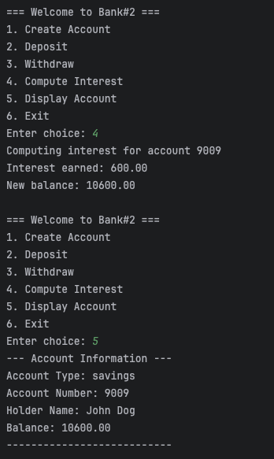

# Java OOP Capstone Project

**Group 2 Members:**  
Ralph Anthony Rafael  
Tyrell Teppang  
Johnvee Mandal

**Project Title:**   
Singleton and Factory Designed Banking System 

**Brief Description of the project:**  

The project created by Group 2 is a simple console-based system designed to manage a single bank account. 
It implements the Singleton design pattern and Factory method, ensuring that only one account can exist 
within the application at any given time. Users can interact with the system through a menu-driven interface to 
perform essential banking operations, including creating a new account, depositing and withdrawing funds, computing 
interest based on account type (savings or checking), and displaying the current account information. 
The application aims to demonstrate fundamental object-oriented programming concepts and team collaboration within 
a simplified banking context.

**Screenshot of output:**  

  
  
  

